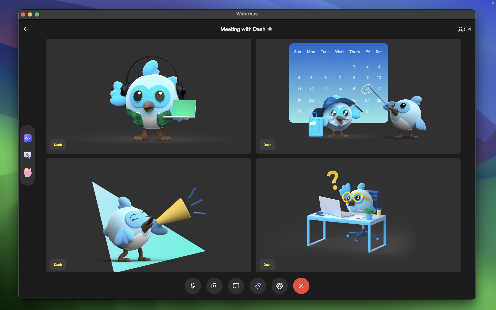

> [!IMPORTANT]  
> Waterbus is an open source video conferencing app built on latest WebRTC SDK. Currently, Waterbus is an early release that is subject to the following limitations: it may have limited support, changes may not be compatible with other pre-general availability versions, and availability may change without notice.

# Flutter [Waterbus](https://docs.waterbus.tech) SDK



Flutter plugin of [Waterbus](https://docs.waterbus.tech). Build video call or online meeting application with SFU model. Supports iOS, Android. [ExampleApp](https://github.com/lambiengcode/waterbus)

## Codec supported
| Codec | VP8 | VP9 | H264 | H265 | AV1 |
| :-----: | :---------------: | :------------: | :------------: | :----------------: | :--------------------------------: |
|   iOS   |        🟢         |       🟢       |       🟢       |         🟢         |         🟢        |
| Android |        🟢         |       🟢       |       🟢       |                  |         🟢        |

## Features

- Join room

```dart
    await WaterbusSdk.instance.joinRoom(
      roomId: roomCode,
      participantId: participantId,
      onNewEvent: (event) {
        switch (event.event) {
          case CallbackEvents.shouldBeUpdateState:
            // rebuild your ui
            break;
          case CallbackEvents.newParticipant:
            final String? participantId = event.participantId;
            if (participantId == null) return;

            // add new participant to your ui
            break;
          case CallbackEvents.participantHasLeft:
            final String? participantId = event.participantId;
            if (participantId == null) return;

            // remove participant to your ui
            break;
          default:
            break;
        }
      },
    );
```

- Leave room

```dart
await WaterbusSdk.instance.leaveRoom();
```

- Prepare Media (will prepare the camera and microphone for you to turn on and off before entering the meeting)
  
```dart
await WaterbusSdk.instance.prepareMedia();
```

## Getting started

- Include this package to your pubspec.yaml

```yaml
waterbus_sdk:
    git:
      url: https://github.com/waterbustech/waterbus-flutter-sdk.git
      path: '.'
      ref: 0.0.1
```

### Android

Ensure the following permission is present in your Android Manifest file, located in `<project root>/android/app/src/main/AndroidManifest.xml`:

```xml
<uses-feature android:name="android.hardware.camera" />
<uses-feature android:name="android.hardware.camera.autofocus" />
<uses-permission android:name="android.permission.CAMERA" />
<uses-permission android:name="android.permission.RECORD_AUDIO" />
<uses-permission android:name="android.permission.ACCESS_NETWORK_STATE" />
<uses-permission android:name="android.permission.CHANGE_NETWORK_STATE" />
<uses-permission android:name="android.permission.MODIFY_AUDIO_SETTINGS" />
```

If you need to use a Bluetooth device, please add:

```xml
<uses-permission android:name="android.permission.BLUETOOTH" android:maxSdkVersion="30" />
<uses-permission android:name="android.permission.BLUETOOTH_ADMIN" android:maxSdkVersion="30" />
```

The Flutter project template adds it, so it may already be there.

Also you will need to set your build settings to Java 8, because official WebRTC jar now uses static methods in `EglBase` interface. Just add this to your app level `build.gradle`:

```groovy
android {
    //...
    compileOptions {
        sourceCompatibility JavaVersion.VERSION_1_8
        targetCompatibility JavaVersion.VERSION_1_8
    }
}
```

### iOS

Add the following entry to your _Info.plist_ file, located in `<project root>/ios/Runner/Info.plist`:

```xml
<key>NSCameraUsageDescription</key>
<string>$(PRODUCT_NAME) Camera Usage!</string>
<key>NSMicrophoneUsageDescription</key>
<string>$(PRODUCT_NAME) Microphone Usage!</string>
```

This entry allows your app to access camera and microphone.

### Note for iOS.
The WebRTC.xframework compiled after the m104 release no longer supports iOS arm devices, so need to add the `config.build_settings['ONLY_ACTIVE_ARCH'] = 'YES'` to your ios/Podfile in your project

ios/Podfile

```ruby
post_install do |installer|
  installer.pods_project.targets.each do |target|
    flutter_additional_ios_build_settings(target)
     target.build_configurations.each do |config|
      # Workaround for https://github.com/flutter/flutter/issues/64502
      config.build_settings['ONLY_ACTIVE_ARCH'] = 'YES' # <= this line
     end
  end
end
```

## Contributing
Contributions are welcome! Please feel free to submit a pull request or open an issue if you encounter any problems or have suggestions for improvements.

## Contact Information

If you have any questions or suggestions related to this application, please contact me via email: lambiengcode@waterbus.tech or lambiengcode@gmail.com.

## Reference: [flutter_webrtc](https://github.com/flutter-webrtc/flutter-webrtc)

## License

Apache License 2.0